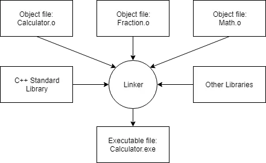

# Compiling process

Source code -> Complier -> Executable -> Hardware -> Program result

For scripting languages, they use an *interpreter* to directly execute the instructions in the source code without requiring them to be compiled into an executable first.  
This is more flexible then compiler but less efficient when running programs because the intepreting process needs to be done every time the program is run.  

# C and C++'s philosophy
"trust the programmer" - which is both powerful and dangerous, providing a high degree of freedom to do what they want. However, this also means that the language often won't stop you from doing things that don't make sense, because it will assume you're doing so for some reason it doesn't understand.  

## What is C++ good at?
C++ excels in situations where high performance and precise control over memory and other resources is needed. Here are a few common types of applications that most likely would be written in C++:  
- video games (C#)
- real-time systems (e.g. for transportation, manufacturing, etc...)
- high-performance financial applications (e.g. high frequency trading)
- graphical applications and simulations
- productivity / office applications
- embedded software
- audio and video processing
- AI and neural networks

# Development flow
```
		Define the problem to solve
				|
		Design a solution
				|
		Write a program that implements the solution
				|
		Compile the program <-------
				|					|
		Link object files			|
				|					|
		Test program -----------> Debug
```

## Define the problem to solve
The "what" step. Coming up with the initial idea fro what you would like a program can be the easiest step, or the hardest. But conceptually, it is the simplest.

## Determine how you are going to solve the problem
The "how" step. There are many ways to solve a problem - however, some of the solutions are good and some of them are bad.

Typically, good solutions have the following characteristics:
- straightforward, not overly complicated or confusing
- well-documented, especially around any assumptions being made or limitations
- built modularly, so parts can be reused or changed later without impacting other parts of the program
- robust, and can recover or give useful error messages when something unexpected happens

## Write the program
This requires programming knowledges and a text editor.

Common text editors should have:
- line numbering
- syntax highlighting and coloring
- an unambiguous font

## Compiling your source code
The C++ compiler sequentially goes through each source code *.cpp* file in your program and does two important tasks:
- First, it checks your code to make sure it follows the rules of the C++ language. If it does not, the compiler will give you an error with the corresponding line number. The compilation process will also be aborted.
- Second, it translates your C++ source code into a maching language file called an **object file**. These are typically named *name.o* or *name.obj*, where *name* is same as the .cpp.

## Linking object files and libraries
After the compiler creates one or more object files, then another program called the linker kicks in. The job of the linke is as followed:
- First, to take all the obj files generated by the compiler and combine them into a single executable program



- Second, in addition to being able to link object files, the linker also is capable of linking library files. A **library file** is a collection of precompiled code that has been "packed up" for reuse in other programs.  
The C++ core language is actually fairly small and concise. However, C++ also comes with an extensive library called the C++ **Standard Library** (usually shortened to *standard library*) that provides additional functionality that you can use in your programs. Most linkers will automatically link in the standard library as soons as you use any part of it.  
There are also other prebuilt libraries by others, e.g. program that plays sound: read sound files from disk, check if they are valid, how to route the sound data to the OS or hardware etc.

- Third, the linker makes sure al cross-file dependencies are resolved properly. For example, if you define something in one .cpp file, and then use it in another .cpp file, the linker connects the two together. If it fails to connect a reference to something with its definition, you'll get a linker error, and the linking process will abort.

!For complex projects, some development environments use a **makefile**, which is a file that decribes how to build a program (e.g. which files to compile and link, or otherwise process in various ways)

## Testing and debugging
Vim debugging:
- vimGDB
- [:help terminal-debug](https://www.dannyadam.com/blog/2019/05/debugging-in-vim/)

Build: compiles all modified code files in the project or workspace/solution, and then links the obj files into an executable. If no code files have been modified since the last build, this option does nothing.  
Clean: removes all cached obj and executables so the next time the probject is built, all files will be recompiled and a new  executable produced.  
Rebuild: does a "clean", followed by a "build".  
Compile: recompiles a signle code file (regardless of whether it has been cached previously). This opeiton does not invoke the linker or produce an executable.  
Run/start: executes teh executable from a prior build. Some IDE will invoke a "build" before doing a "run" to ensure you are running the lastest version of your code. Otherwise will just execute the prior executable.  

# Cofiguring your compiler

## Build configurations
A **build configuration** or a **build target** is a collection of project settings that determines how your IDE will build your project. Though these are usually left defaulted unless you know what you're doing and have a specific needs:
	- what the executable will be named
	- what dirs the IDE will look in for other code and library files
	- to keep or strip out debugging information
	- how much to have the compiler optimize the program

Two build configurations: a release and a debug configuration
- The **debug configuration** is generally the one you will use when writing your programs. It turns off all optimizations, and includes debugging information, which makes your programs larger and slower, but much easier for debugging.
- The **release configuration** is to be used when releasing your program to the public. It is typically optimized for size and proformance, doesn't contain extra debugging information. This is also useful for testing the performance of your code.

## Compiler extensions
The C++ standard defines rules about how progras should behave in specific circumstances. And in most cases, compilers will follow these rules. However, many compilers implement their own changes to the language, often to enhance compatibility with other version of the language (e.g. C99), or for historical reasons. These compiler-specific behaviors are called **compiler extensions**.

Writing programs with extensions allows you to write program that is incompatible with the C++ standard. This can cause problems, since these extensions are often enabled by default, making programs using non-standard extensions not being compiled on other compilers or being compiled incorrectly.

For gcc/g++, to disable extensions, add *-pedantic-errors* flag to the compile cmd.

## Warning and error levels
Errors are definitively violates to the rules of the language, which will cause an abortion of compiler.  
While, warnings won't stop the compiler, it's definitely best to not let them pile up.  
For gcc/g++, to:
	- increase warning levels: *-Wall -Weffc++ -Wextra -Wsign-conversion*
	- treat warings as erros: *-Werror*

## Choosing a language standard
C++98, C++03, C++11, C++14, C++17, etc.  
Finalized language standards are named after the years in which they are finalized. However, while it is being agreed upong, it's not clear what year the finalization will take place. Therefore there're codename:
	- c++1x = C++11
	- c++1y = C++14
	- c++1z = C++17
	- c++2a = C++20
	- c++2b = C++23

In professional environments, it's common to choose the standard that is one or two versions back from the lastest.

For gcc/g++, using flag *-std=c++{ver}*
