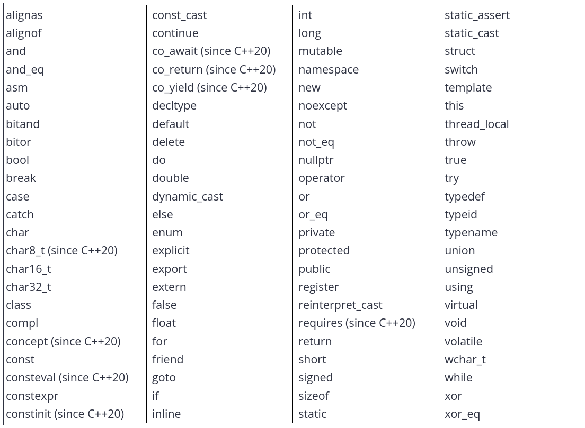

# 1.1 Statements and the structure of a program

## Statement
A computer program is a sequence of instructions that tell the computer what to do. A **statement** is a type of instruction that causes the program to *perform some action*.

This is by far the most common type of instruction in a C++ program. Being the smallest independent unit of computation in C++.

*Most* statements end in a semicolon (;). Some types of statements are declaration, jump, expression, compound, selection (conditional), iteration (loops), try blocks...

## Function and the main function
Statements are typically grouped into units called functions. A **function** is a collection of statesments that executes sequentially (in order, top to bottom).

!Rule: every C++ program must have a special function named **main**.

Programs typically terminate when the last statement inside *main* has executed (though program may abort early, or do some cleanup afterwards).

Function are typically written to do a specific job, most commonly used organizing tool in a program.

## Dissecting Hello World!
``` cpp
#include <iostream>

int main()
{
	std::cout << "Hello world!";
	return 0;
}
```

Line 1 called a *preprocessor directive*. It indicates that we would like to use the contents of the iostream library, this is necessary for the read and write text from/to the console, which is std::cout in our case.  
Line 2 is blank, just to make the code more readable.  
Line 3 telling that we're going to write/define a function called *main*.  
Line 4 and 7 tell the compiler which lines are part of the *main()*. Every lines in between those curly braces are part of the function, called the function body.  
Line 5 is a statement, allowing us to write to the console "Hello world!".  
Line 6 is a return statement. When an executable program finishes running, the prog sends a value back to the OS in order to indicate whether it ran successfullyor note. 0 indicates that "everything went okey!".

## Syntax and syntax errors
The rules that govern how sentences/statements are constructed in programming is called **syntax**.

Syntax errors are compiler errors taht occurs at compile-time when your program violates the grammer rules of the C++ language.


# 1.2 Comments
programmer-readable note that is inserted directly into the source code of the program. They are ignored by the compiler and are for the programmers' use only.

Single-line comment `// comment`, used to make quick comment about a single line of code. Pay attention to indentation when placing comments, or consider moving them above the line it is commenting.  
Multi-line comment `/* comment  */`, can't be nested.

Proper use of comments:
- For a given library, program, or function, comments are best use to describe *what* they are trying to archieve. Put above them.
- Within a library, program or function, comments can be used to decribe *how* the code is going to accomplish its goal.
- Statement-level comments should describe *why* the code is doing something, instead of *what*.
- Others: good reminders why the solution is this way instead of another.
- Should be written so that it makes sense to someone who has no idea what the code does.


# 1.3 Objects and variables
## Data
In computing, **data** is any informaiton that can be moved, processed, or stored by a computer. "Programs are collections of instructions that manipulate data to produce a desired result."

Program can acquire data to work with in many ways: from a file or database, over a network, from the user's input or programmers putting data directly into the source code. These data are stored in a format that is efficient for storage and processing, thus not readable by human, which is binary.

## Obj and var
Computers have memory, called **RAM** (random access memory), tha is available for your programs to use. RAM as a series of numbered mailboxes that can each be used to hold a piece of data while the program is running. A single piece of data, stored in memory somewhere, is called a **value**.

In C++, direct memory access is not allowed, instead indirectly through an object. An **object** is a region of storage (usually memory) that has a value and other associated properties, *go get the value of this object*.  
Objs can be named or unnamed (anonymouse). A named one is called a **variable**, and its name is called an **identifier**.  
In C++, *object* typically refers to a variable, data structure.

## Variable instantiation
To create a variabel, we use a special kind of declaration statement called a **definition**, which is different from *declaration*. E.g. `int x`.

In **runtime**, the variable will be instantiated, or simply *created* and assigned a memory address. An instantiated obj is sometimes also called an **instance**.

## Data types
Telling the type of that stored data, being number, letter, text, etc.

In C++, the type of a variable must be known at **compile-time**, and that type cannot be changed without recompiling the program. Meaning, int variable can only store integer value, we must use a different variable to store different kind of value.

Aside from a few pre-defined types, there're also user-defined types which is what makes C++ powerful.

``` cpp
int a, b;			// correct
int a, double b;	// error
int a; double b;	// correct but not recommended
// corret
int a;
double b;
```

Although we can, best practice is to define variables in separate lines, even if they are of same types, and add comments to why they are needed.


# 1.4 Variable assignment and initialization
After a variable's definitions, we can give it a value by using the *= operator* (assignment operator), the process is called **copy assignment**.
``` cpp
int width;
width = 5;
```

## Initialization
Providing an initial value at definition time, called **initialization**. The value is called **initializer**.
``` cpp
int a;		// no initializer
int b = 5;	// initializer after equals sign
int c( 6 );	// initializer in parenthesis
int d { 7 };// initializer in braces
// extra spaces in c and d cases are not is subjective
```

### Types of initializations
Default initialization: When no initializer provided, which usually left variable with an indeterminate value (garbage value).

Copy initialization: Inherited from the C language `int width = 5` with the use of equals sign (=).

Direct initialization: an initializer is in parenthesis no equals sign involved. This can't be used with all types, e.g. object with a list of data.

Brace initialization: also called **uniform** or **list** initialization, using curly braces.
- direct brace: `int with{5};`
- copy brace: `int width = {5};`

Direct or copy brace funciton almost identically, but direct form is preferred.  
Added benefit of the braces, is disallowing "narrowing" conversions. This means if you initialize a variable with a value it can't safely hold, the compiler will throw a warning or error.
``` cpp
int width { 4.5 }; // error: not all double values fit into an int
```

### Value and Zero initialization
Initializing with empty {} is called **value initialization**, and it's usually filled with zero or empty depends on the datat types. While explicitly using {0} is called **zero initialization**.

Use *value* when variable's temporary and will be replaced, while *zero* if you're actually using that value. E.g. printing or taking value for said variable directly after its creation.


# 1.5 Introduction to iostream: cout, cin, and endl

## The input/output library
The io library is part of C++ standard library that deals with basic input and output. To use the library, we have to include the *iostream* header at the top of any code files that uses the content defined in *iostream*, like `#include <iostream`.

## std::cout
Character output, using with the **insertion operator** (<<)

## std::endl vs '\n'
Using std::endl can be a bit inefficient, as it actually does two jobs:
	- moves the cursor to the next line
	- makes sure that the output shows up on screen immediately, or ***flushing*** the output.  
Text writing using std::cout often flushes output anyway, so having std::endl performs another flush is rarely important.
Therefore, using '\n' is preferred.

## std::cin
Character input, using with the **extraction operator** (>>)

Input without having to press *enter*: [PDCurses](https://pdcurses.org/)


# 1.6 Uninitialized variables and undefined behavior

# Uninitialized variables
C/C++ does not initialize most variables to a gien value (such as 0) automatically. Thus, when a variable is assigned a memory location by the compiler, the default value is whatever (garbage) value happens to already be in that memory location.

A variable without a known value is called **uninitialized**. Though it is not strictly opposite of *initialized*.  
Initialization: the obj is given a known value at definition  
Assignment:		the obj is given a known value after definition  
Uninitialized:	the obj has not bene given a known value *yet*

This lack of initialization is a performance optimization inherited from C, back when computers were slow, it helps avoid having to spend time default-initialize variables. While this "lack of initialization" can be done selectively and intentionally while we are more skilled.

Some modern compilers do throw compile-time error when they see an uninitialized variable being used, to work around it
``` cpp
#include <iostream>

void doNothing(int&) {}

int main()
{
	int x;
	doNothing(x);
	std::cout << x;
	return 0;
}
```

## Undefined behavior
Or UB, is the result of executing code whose behavior is not well defined by the C++ language.

Some symptoms:
- produces different results every time it is run
- consistently produces the same incorrect result
- behaves inconsistently (sometimes produces correct results sometimes not)
- seems like it's working but then results in incorrectness later
- crashes, either immediately or later
- works on some compilers but not others
- works until some seemingly unrelated code are changed
- or well actually working


# 1.7 Keywords and naming identifiers

## Keywords
As of C++20, there are 92 reserved keywords, which each has a special meaning in the C++ language.


C++ also defines special identifiers: *override*, *final*, *import* and *module*, while havign special meaning in certain contexts but are not reserved.

## Naming identifiers
- cannot be a keyword
- can only be composed of letters (lower and upper), numbers and underscores
- must begin with a letter or an underscore
- case-sensitive

Best practices:
- For variables and functions:
``` cpp
// camel style
int myVariables {};
int myFunction();
// intercapped style
int my_other_variable {};
int my_other_function();
```
- For user-defined types (struct, classes and enumerations):
``` cpp
class MyClass {};
struct MyStruct {};
```
- Should avoid starting with underscore, since these are typically reserved for OS, library and/or compiler use.
- The name should be clear what the value they are holding means
- Good rule of thumb: length of identifer proportional to how widely it's used.
- Avoid abbreviation
- Clarifying comment


# 1.8 Whitespace and basic formatting
Referring to spaces, tabs and newlines. Whitespace-independent language, except for when processing text literals. Like:  
``` cpp
std::cout << "Hello 
	world"; // Not allowed!
std::cout << "Hello "
	"world\n"; // allowed
```

Not formatting restrictions. Best styles are the ones that are readable and provide consistency.

Some recommendations:
- Either spaces or tabs is fine, while spaces will always look correct regardless of editor.
- Two acceptable styles for placing functions' braces, opening brace on same line or one a separated one.
- Each statement within curly braces should start one tab in from the opening of the function it belongs to.
- Lines shouldn't be too long, maximum of 80 characters is preferred. Broken-up lines should have a reasonable breakpoint.
- If long line is split with an operator (eg. << or +), the operator should be placed at the beginning of the next line.
- Using whitespaces to make your code easier to read by aligning values or comments or adding spacing between blocks of code.


# 1.9 Introduction to literals and operators
A **literal** (aka. literal constant) is a fixed value that has been inserted directly into the source code.

In math, an **operation** is a mathematical calculation involving zero or more input values (called **operands**) that produces a new value (called an output value). The specific operation to be performed is denoted by a construct (symbol or pair of symbols) called an **operator**.  
Number of operands took as input is called *arity*.

C++'s operators come in three different arities:
- Unary: operators act on one operand, like *-operator*, *-5*
- Binary: operators act on two operands (known as left and right), such as *operator+* or *operator>> (extraction)* or *operator<< (insertion)*.
- Ternary: operators act on three operands. There is only one of these in C++.

Chaining and order of operators, for now, arithmetic: Parenthesis first, then Exponents, then Mutiplication & Division, then Addition & Substraction. Arrbreviated as *PEMDAS*.


# 1.10 Introduction to expressions
An **expression** is a combination of literals, operators, and function calls that can be executed to produce a singular value.  
The processing of executing an expression is called **evaluation**, and the single value produced is called the **result** of the expression.

Expressions are always evaluated as part of statements.
``` cpp
// type indentifer { expression };
int x{ 2 + 3 };
```

**Expression statment** is a statement taht consists of an expression followed by a semicolon.
