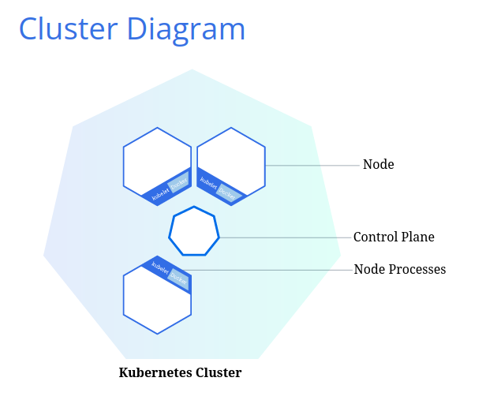
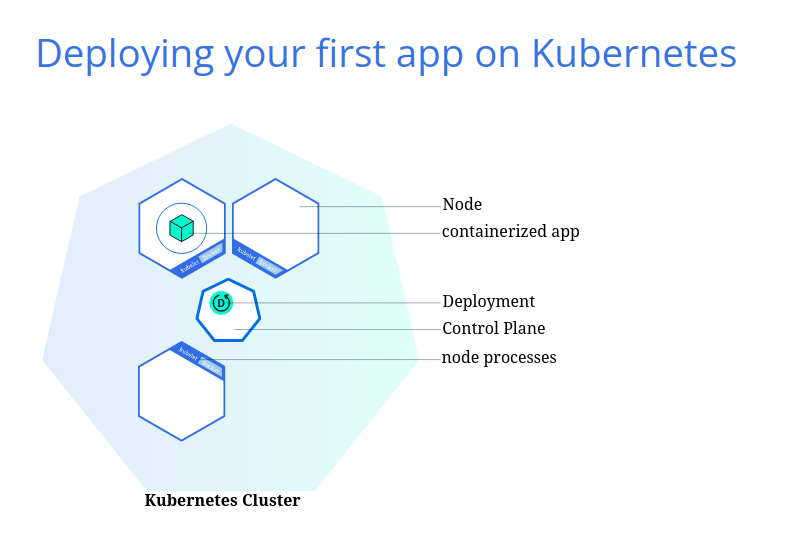

# What is Kubernetes?
Kubernetes, or K8s, is an open-source system for automating deployment, scaling, and management of containerized applications.

It groups containers that make up an application into logical units for easy management and discovery.  

Some of its features are:
- Automated rollouts and rollbakcs: Kubernetes progressively rolls out changes to your applications or its configuration, while monitoring application health to ensure it doesn't kill all your instances at the same time.
- Service dicovery and load balancing: Kubernetes gives Pods their own IP addresses and a single DNS name for a set of Pods, and can load-balance across them.
- Storage orchestration: Automatically mount the storage system of your choice, whether from local storage, a public cloud provider such as AWS, GCP, or a network storage system such as NFS, iSCSI, Ceph, Cinder.
- Self-healing: restarts failed containers, replaces and reschedules containers when nodes die, kills containers that don't respond to user-defined health check, doesn't advertise them to clients until they are read to serve.
- Secret and configuration management: deploy and update without rebuilding image, nor exposing secrets in your stack configuration
- Automatic bin packing: places containers based on their resource requirements and other constraints, while not sacrificing availability. Mix critical and best-effort workloads in order to drive up utilization and save even more resources.
- Batch execution: manage batch and CI workloads, replacing containers that fail, if desired.
- Horizontal scaling: scale application up and down with a simple command, with a UI or automatically based on CPU usage.
- IPv4/IPv6 dual-stack: allocation of IPs to Pods and Services.
- Designed for extensibility: add features to your cluster without changing upstream source code.

## Create a Cluster

### Kubernetes Cluster
Kubernetes coordinates a highly available cluster of computers that are connected to work as a single unit.  

The abstractions in Kubernetes allow you to deploy containerized applications to a cluster without tying them specifically to individual machines. To make use of this new model of deployment, applications need to be packaged in a way that decouples them from individual hosts: they need to be containerized.  
Containerized applications are more flexible and available than in past deployment models, where applications were installed directly onto specific machines as packages deeply intergrated into the host.

A Kubernetes cluster consists of two types of resources:
- The **Control Plane** coordinates the cluster
- **Nodes** are the workers that run applications

#### Cluster Diagram


The Control Plane is responsible for managing the cluster. It coordinates all activities in the cluster, such as scheduling applications, maintaining applications' desired state, scaling applicaitons, and rolling out new updates.

A Node is a VM or a physical computer that serves as a worker machine in a Kubernetes Cluster. Each node has a *Kubelet*, which is an agent for managing the node and communicating with the Kubernetes control plane. The node should also have tools for handling container operations, such as *containerd* or *Docker*.  
A Kubernetes cluster that handles production traffic should have a minimum of three nodes because if one node goes down, both an [etcd](https://kubernetes.io/docs/concepts/overview/components/#etcd) member and a control plane instance are lost, and redundancy is compromised. You can mitigate this risk by adding more control plane nodes.

#### Operations
When you deploy applications on Kubernetes:
- you tell the control plane to start the application containers
- the control plane schedules the containers to run on the cluster's node
- the nodes communicate with the control plane using the [Kubenetes API](https://kubernetes.io/docs/concepts/overview/kubernetes-api/), which the control plane exposes.
- end users can also use this API directly to interact with the cluster

### Minikube
Minikube is a lightweight Kubernetes implementation that creates a VM on your local machine and deploys a simple cluste containing only one node. It's available on Linux, MacOS and Windows systems.

The Minikube CLI prodives basic bootstrapping operations for working with your cluster, including start, stop, status, and delete.

### Hand-on
``` bash
minikube versino

minikube start

kubectl version # client and server version

kubectl cluster-info # cluster details

kubectl get nodes # view the nodes in the cluster
```

## Deploy an App

### Kubernetes Deployment
Once you have a running Kubernetes cluster, you can deploy your containerized applications on top of it. To do so, you create a kubernetes **deploment** configuration.  
The Deployment instructs Kubernetes how to create and update instances of your application. Once you've created a Deployment, the Kubernetes control plane schedules the application instances included in that Deployment to run on individual Nodes in the cluster.

Once the application instances are created, a Kubernetes Deployment Controller continuously monitors those instances.  
If the Node hosting an instance goes down or is deleted, the Deployment controller replaces the instance with an instance on another Node in the cluster. **This provides a self-healing mechanism to address machine failure or maintenance.**

In a pre-orchestration world, installation scripts would often be used to start applications, but they did not allow recovery from machine failure. By both creating your application instances and keeping them running accross Nodes, Kubernetes Deployments prodive a fundamentally different approach to application management.

### kubectl


You can create and manage a Deployment by using the Kubernetes command line interface, **Kubectl**. Kubectl uses the Kubernetes API to interact with the cluster.

When you create a Deployment, you'll need to specify the container image for your application and the number of replicas you want to run. You can change that information later by updating the Deployment.

https://kubernetes.io/docs/tutorials/kubernetes-basics/deploy-app/deploy-intro/
