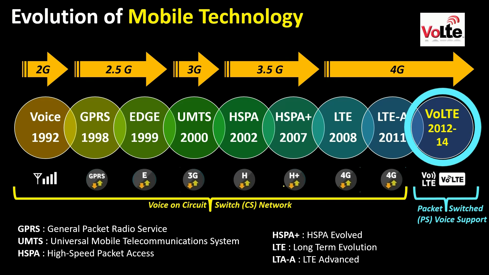

Analog vs Digital:
wave with their frequency and amtitude
vs
0 1, discrete step

analog amplifier: amplified both noise and the signal
digital regenerator: noise elimination and regenerated signal

LTE network, 4 major components:
- Core Network: brain of the network, consits of servers and gateways that controll access, QoS, billing and network policies for multi-media access, like telephony call.
- RAN - Radio Access Network: cell towers, having enode and antenna to providing coverage for your devices (blasting a cone-shape to requiring devices, may lead to overlapping cones, result in conflicting signal transmission)
- Backhaul Network: made up of fiber and micro-wave connections, connecting the RANs to each other and to the Core Network; also representing the roadway for data to travel from you/your device back to the Core Network, to access/use their services.
- Device/User Equipment: connect to RANs

Key features or Public Safety:
- Exclusive Spectrum
- High Speed
- Priority and Preemption
- SON - Self-organizing Network

---

# VoLTE - Voice over LTE (4G)  
Voice call carries over data network, 4G, using IP  
works and charges like cellular calls  
better codecs, hd voice quality and better setup time

## Pre-VoLTE
- 2009 came 4G but VoLTE not until 2014
- still using CSFB (circuit switch fall back) to operate voice call, over 2/3G network
- Circuit Switched Network

## VoLTE
- built upon 4G, and (?) LTE network, with LTE providing the basis of all IP to IP Network
- Packet Switched Network: stream of IP packets, doesn't required dedicated or reversed path
- voice carried over IP Network

## Benefits for Users
Better user experience: no more constant switching between different generaton fo cellulars

HD Calling: thanks to IP-to-IP, Mobile Operators can use bigger pipers and better codecs

No drop in background data speed: since there's no more switching between 4G and 2/3G, operation over internet is uneffected whenever users are on call  
For example, in the past on call using 2G users will lose internet connection

Faster connecting speed

Better battery life: again a benefit from not having to switch betwwen Gs

Inbuilt Support for video calls

# Evolution of Mobile Technology

IMS network - core network providing VoLTE services  
"One Voice" to provide seemless and common solution for VoIP  
GSMA - Global System for Mobile Communication, worked to standarize this as the next generation for voice calls over LTE along with 3GPP

# Requirements for VoLTE Services
Mobile Operator side:
- Good 4G coverage
- Activation of its services

Customer side:
- VoLTE supporting handset
- Software supporting
- ISIM or USIM
- VoLTE enabled

# Benefits for MOs
