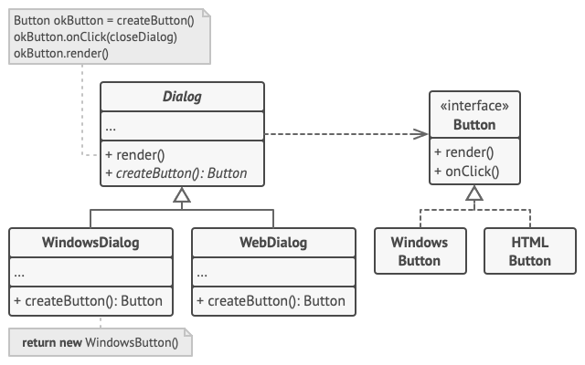

# Factory Method

## Intent

Factory Method is a creational design pattern that provides an interface for creating objects in a superclass, but allows subclasses to alter the type of objects that will be created.

## Problem

Logistics management application, where early version can only handle transportation by trucks, so most of the code lives inside the `Truck` class. After a while, the app got popular and sea companies also want to incorporate sea logictics.

## Solution

The Factory Method suggests that you replace direct object construction calls (using `new` operator) with calls to a special *factory* method. These objects returned by a factory method are often referred to as *products*.

At first glance, we just moved the constructor call from one part of the program to another. However, consider this: now you can override the factory method in a subclass and change the class of products being created by the method.

There's a slight limitation though: subclasses may reutrn different types of products only if these products have a common base class or interface. Also, the factory method in the base class should have its return type declared as this interface.

For example, both `Truck` and `Ship` classes should implement the `Transport` interface, which declares a method called `deliver`. Each class implements this method differently: trucks deliver cargo by land, ships deliver cargo by sea. The factory method in the `RoadLogistics` class returns truck objects, whereas the factory method in the `SeaLogistics` class returns ships.

The code that uses the factory method, often called *client code* doesn't see a difference between the actual products returned by various classes. It treats all the products as abstract *Transport*, knowing that all transport objects are supposed to have the *deliver* method, but doesn't care how exactly it works.

## Structure

1. The **Product** delcares the interface, which is common to all objects that can be produced by the creator and its subclasses.

2. **Concrete Products** are different implementations of the product interface.

3. The **Creator** class declares the factory method that returns new product objects. It's important that the return type of this method matches the product interface.

You can declare the factory method as `abtract` to force all subclasses to implement their own versions of the method. As an alternative, the base factory method can return some default product type.

Note, despite its name, product creation is **not** the primary responsibility of the creator. Usually, the creator class already has some core business logic related to products. The factory method helps to decouple this logic from concrete product classes. Here is an analogy: a large software development company can have a training department for programmers. However, the primary function of the company as a whole is still writing code, not producing programmers.

4. **Concrete Creators** override base factory method so it returns a different type of product.

Note that the factory doesn't have to **creat** new instances all the time. It can also return existing objects from a cache, an object pool, or another source.

## #Pseudocode
This example illustrate how the **Factory Method** can be used for creating cross-platform UI elements without coupling the client code to concrete UI classes.

The base `Dialog` class uses different UI elemtns to render its window. Under various operating systems, these elements may look a little bit different, but they should still behave consistently. A button in Windows is still a button in Linux.

When the factory method comes into play, you don't need to rewrite the logic of the `Dialog` class for each operating system. If we declare a factory method that produces buttons inside the base `Dialog` class, we can later create a subclass that returns Windows-styled buttons from the factory method. The subclass then inherits ost of the code from the base class, but, thanks to the factory method, can render Windows-looing buttons on the screen.

For this pattern to work, the base `Dialog` class must work with abstract buttons: a base class or an interface that all concrete buttons follow. This way the code within `Dialog` remains functional, whichever type of buttons it works with.

Of course, you can apply this approach to other UI elements as well. However, with each new factory method you add to the `Dialog`, you get closer to the ***Abstract Factory*** pattern, which will be talked about elsewhere.

## Applicability

- Use the Factory Method when you don't know beforehand the exact types and dependencies of the objects your code should work with.  
The Factory method separates product construction code from the code that actually uses the product. Therefore it's easier to extend the product construction code independently from the rest of the code. Eg: to add a new product type to the app, you'll only need to create a new creator subclass and override the factory method in it.

- Use the Factory Method when you want to provide users of your library of framework with a way to extend its internal components.  
Inheritances is probably the easiest way to extend the default behavior of a library or framework. But how would the framework recognize that your subclass should be used instead of a standard component?  
The solution is to reduce the code that constructs components across the framework into a single factor method and let anyone override this method in addition to extending the component itself.  
Let's see how that would work. Imagine that you write an app using an open source UI framework. Your app should have round buttons, but the framework only provides square ones. You extend the standard `Button` class with a glorious `RoundButton` subclass. But now you need to tell the main `UIFramework` class to use the new button subclass instead.  
To achieve this, you create a subclass `UIWithRoundButton` from a base framework class and override its createButton method. While this method returns `Button` objects in the base class, you make your subclass return `RoundButton` objects. Now use the `UIWithRoundButton` class instead of `UIFramework`. And that's it!

- Use the Factory Method when you want to save system resources by reusing existing objects instead of rebuilding them each time.  
You often experience this need when dealing with large, resource-intensive objects such as database connections, file system, and network resources.  
Let's think about what has to be done to reuse an existing object:
	- First, you need to create some storage to keep track of all of the created objects.
	- When someone requests an object, the program should look for a free object inside that pool.
	- ... and then return it to the client code.
	- If there are no free objects, the program should create a new one (and add it to the pool).
That's a lot of code! And it must all be put into a single place so that you don't poluute the program with duplicate code.  
Probably the most obvious and convenient place where this code could be placed is the constructor of the class whose object we're trying to reuse. However, a constructor must always return **new objects** by definition. It can't return existing instances.  
Therefore, you need to have a regular method capable of creating new objects as well as reusing existing ones. That sounds very much like a factory method.

## How to implement

- Make all products follow the same interface. This interface should declare methods that make sense in every product.
- Add an empty factory method inside the creator class. The return type of the method should match the common product interface.
- In the creator's code find all references to product constructors. One by one, replace them with calls to the factory method, while extracting the product creation code into the factory method.  
You might need to add a temporary parameter to the factory method to control the type of returend product.  
At this point, the code of the factory method may look pretty ugly. It may have a large `switch` statement that picks which product class to instantiate. But don't worry, we'll fix it soon enough.
- Now, craete a set of creator subclasses for each type of product listed in the factory method. Override the factory method in the subclasses and extract the appropriate bits of construction code from the base method.
- If there are too many product types and it doesn't make sense to create subclasses for all of them, you can reuse the control parameter from the base class in subclasses.  
For instance, imagine that you have the following hierarchy of subclasses: the base `Mail` class with a couple of subclasses: `AirMail` and `GroundMail`; the `Transport` classes are `Plane`, `Truck` and `Train`. While the `AirMail` class only uses `Plane` objects, `GroundMail` may work with both `Truck` and `Train` objects. You can create a new subclass (say `TrainMail`) to handle both cases, but there's another option. The client code can pass an argument to the factory method of the `GroundMail` class to control which product it wants to receive.
- If, after all of the extractions, the base factory method has become empty, you can make it abstract. If there's something left, you can make it a default behavior of the method.

## Pros and Cons

Pros:
- You avoid tight coupling between the creator and the concrete products.
- *Single Responsibility Principle*. You can move the product creation code into one place in the program, making the code easier to support.
- *Open/Closed Principle*. You can introduce new types of products into the program without breaking existing client code.

Cons:
- The code may become more complicated since you need to introduce a lot of new subclasses to implement the pattern. The best case scenario is when you're introducing the pattern into an existing hierarchy of creator classes.

## Relations with Other Patterns
- Many designs start by using Factory, and evovle toward ***Abstract Factory***, ***Prototype***, or ***Builder***, which are more flexible, but more complicated to customize.
- ***Abstract Factory*** classes are often based on a set of Factory Method, but you can also use ***Prototype*** to compose the methods on these classes.
- You can use Factory Method along with **iterator** to let collection subclasses return different types of iterators that are compatible with the collections.
- ***Prototype*** isn't based on inheritance, so it doesn't have its drawbacks. On the other hand, Prototype requires a complicated initialization of the cloned object, while Factory Method doesn't.
- Factory Method is a specialization of ***Template Method***. At the same time, a *Factory Method* serve as a step in a large *Template Method*.
