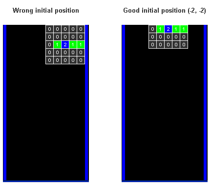

# [Javier Lopez: Tetris tutorial in C++ platform independent](https://javilop.com/gamedev/tetris-tutorial-in-c-platform-independent-focused-in-game-logic-for-beginners/)

***!! Personal paraphrases/interpretation below !!***

## Linux Platform

Installing **libsdl-gfx1.2-dev** and **libsdl1.2-dev**:  
`$ sudo pacman -S sdl2 sdl2_gfx sdl12-compat sdl_ttf sdl2_ttf`  
- *compat* - SDL 1.2 runtime compatibility lib using SDL 2.0  
- *ttf*    - using TrueType fonts in SDL applications

# Keys
| ESC               | Quit the game                       |
|-------------------|-------------------------------------|
| z                 | Rotate piece                        |
| x                 | Drop piece                          |
| Left, Right, Down | I will not offend your intelligence |

# Introduction

## What will I learn from this?
- How to store pieces and board using matrices (*multimensional arrays*)
- How to solve the rotation problem in Tetris, with an intelligent hack
- How to check collisions between the pieces and the board.
- How the main loop of a Tetris game works.

## License
Crediting to Javier Lopez.

# Step 1: The pieces `file Pieces.h`
Creating class to ***store*** all 7 pieces: square, I, L, L-mirrored, N, N-mirrored and T.

These pieces are defined using matrix of 5x5 (not 4x4 so it can hold all piece variants) cells:  
- 0 means *no block*
- 1 means *normal block*
- 2 means *pivot block* - a rotation point

For example, an N piece:
``` c++
{0, 0, 0, 0, 0},
{0, 0, 0, 1, 0},
{0, 0, 2, 1, 0},
{0, 0, 1, 0, 0},
{0, 0, 0, 0, 0}
```

Up next is ***piece rotation***, aside from using complex rotation algebra, store 4 variants of the same piece, each as a rotation.
``` c++
{0, 0, 0, 0, 0},	{0, 0, 0, 0, 0},	{0, 0, 0, 0, 0},	{0, 0, 0, 0, 0},
{0, 0, 0, 1, 0},	{0, 1, 1, 0, 0},	{0, 0, 1, 0, 0},	{0, 0, 0, 0, 0},
{0, 0, 2, 1, 0},	{0, 0, 2, 1, 0},	{0, 1, 2, 0, 0},	{0, 1, 2, 0, 0},
{0, 0, 1, 0, 0},	{0, 0, 0, 0, 0},	{0, 1, 0, 0, 0},	{0, 0, 1, 1, 0},
{0, 0, 0, 0, 0} 	{0, 0, 0, 0, 0}		{0, 0, 0, 0, 0},	{0, 0, 0, 0, 0},
```

Be careful when 'showing the block', the pieces should:  
- appear first with their respective piece 1, 2, not with the 0s of the matrix
- '2' block to be centered
- shown their block rows one by one



This translation requires two numbers, for horizontal and vertical. These will be in `Game();` class when creating the piece.  
The array that stores these displacements:  
```c++
Square {
	{-2, -3},
	{-2, -3},
	{-2, -3},
	{-2, -3}
}
// etc.
```

